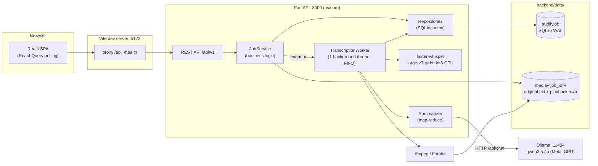

# Arsitektur

Gambaran sistem Audify: tech stack, komponen, lapisan kode, infrastruktur, dan alasan di balik setiap keputusan desain.

## Tech stack

Versi = yang terpasang di mesin dev per 2026-10-01.

### AI / media

| Komponen | Versi | Peran |
|---|---|---|
| **Whisper large-v3-turbo** (OpenAI, open-weight) | — | Model speech-to-text. Dipilih lewat benchmark di `spike/`: WER 5,7% pada sample campuran ID+EN |
| **faster-whisper** (CTranslate2 backend) | 1.2.1 (CT2 4.8.2) | Runtime Whisper: `int8`, **CPU**, VAD Silero (via onnxruntime) aktif, word timestamps |
| **Ollama** | 0.34.4 | Server LLM lokal (`/api/chat`), pakai GPU Metal di Apple Silicon |
| **Qwen 3.5 4B** (`qwen3.5:4b`, Q4_K_M) | — | LLM untuk notulen (Ringkasan, Poin Penting, Keputusan, Action Items, Pertanyaan Terbuka) |
| **ffmpeg / ffprobe** | 9.0.2 | Transcode ke `playback.m4a` (AAC mono 96 kbps), baca durasi, deteksi stream video |

### Backend

| Komponen | Versi | Peran |
|---|---|---|
| Python | 3.12 | Runtime |
| FastAPI + Uvicorn | 0.141 / 0.54 | REST API (`/api/v1`), OpenAPI docs di `/docs` |
| SQLAlchemy | 2.1 | ORM; **SQLite** mode WAL (API baca sambil worker tulis progress) |
| Pydantic + pydantic-settings | 2.13 / 2.15 | Validasi request/response, config dari env `AUDIFY_*` |
| httpx | 0.28 | Client HTTP ke Ollama |
| pytest + ruff | — | Test (transcriber & LLM palsu) dan lint/format |

### Frontend

| Komponen | Versi | Peran |
|---|---|---|
| React | 19.3 | UI |
| Vite | 8.3 | Dev server + bundler; proxy `/api` → backend |
| TypeScript | 6.0 | Type checking |
| TanStack React Query | 5.104 | Server state, polling progress job/summary |
| React Router | 7.18 | Routing (`/`, `/files`, `/jobs/:jobId`) |
| zod | 4.6 | Validasi bentuk response API di runtime |
| react-markdown + remark-gfm | 10.1 / 4.0 | Render notulen (Markdown, checkbox action items) |
| lucide-react | 1.48 | Ikon |
| CSS Modules | — | Styling; tema terang/gelap via `data-theme` + `prefers-color-scheme` |
| Vitest + Testing Library + jsdom | 4.1 | Unit/component test |
| oxlint | 1.81 | Lint |

Browser API yang dipakai: `MediaRecorder` (rekam mic), `<audio>` / `<video>` dengan HTTP Range (seek).

## Komponen & proses

Monolit lokal, single-user, tiga proses:



### Lapisan backend (`backend/app/`)

| Lapisan | File | Tanggung jawab |
|---|---|---|
| Entry | `main.py` | App factory `create_app()` (test bisa inject transcriber/LLM palsu), lifespan: buat DB, start/stop worker |
| API | `api/v1/endpoints/{jobs,tags,settings,ai}.py` | HTTP saja: parse, panggil service, map error → status code |
| Service | `services/job_service.py` | Upload, search, edit, export, re-transcribe, summary request, deteksi video |
| Worker | `services/worker.py` | Satu thread, antrean FIFO `(TRANSCRIBE \| SUMMARIZE, job_id)`; requeue job yang terputus saat restart |
| Engine | `services/transcriber.py`, `services/summarizer.py`, `services/llm.py` | `Transcriber` & `LLMClient` = `Protocol` → engine bisa diganti tanpa ubah worker |
| Media | `services/media.py` | Wrapper ffmpeg/ffprobe |
| Export | `services/exporters.py` | TXT, SRT, VTT, Markdown, JSON |
| Data | `models/job.py`, `repositories/*`, `core/database.py` | ORM + query (search `LIKE` dengan escape) |
| Core | `core/config.py`, `core/logging.py`, `core/deps.py` | Settings env, request-id di log (`X-Request-ID`), dependency injection |

### Struktur frontend (`frontend/src/`)

```
App.tsx                      routes: / · /files · /jobs/:jobId
components/AppShell/         sidebar, toolbar (search global, tema, settings)
components/ui/               Modal, SegmentedControl
lib/                         apiClient (fetch + zod), theme, time, highlight
modules/jobs/
  api/jobsApi.ts             schema zod + endpoint
  hooks/                     useJobs (polling), usePlayer (satu media element), useRecorder,
                             useSummary, useUploadFiles
  components/                TranscriptEditor, PlayerBar, VideoPreview, SidePanel,
                             SummaryPanel, ExportMenu, TagEditor, JobList, ...
  pages/                     DashboardPage, JobsPage, JobDetailPage
modules/settings/            SettingsModal (General / Transcription / AI Summary)
```

Layout editor: **panel kiri** (preview video → tab AI Summary | Info) · **transkrip kanan** · **player bar bawah** yang mengendalikan satu elemen media (`<audio>` atau `<video>`).

## Infrastruktur

Saat ini **lokal di satu Mac** — tidak ada server, container, atau cloud.

| Proses | Port default | Dijalankan dengan | Catatan |
|---|---|---|---|
| Backend (FastAPI + worker) | `8000` | `uvicorn --reload` | Worker thread hidup di proses yang sama |
| Frontend (Vite dev) | `5173` | `npm run dev` | Proxy `/api` & `/health` ke `AUDIFY_BACKEND_URL` |
| Ollama | `11434` | `ollama serve` | Tidak auto-start setelah restart Mac |

**Mesin dev:** Apple A18 Pro (2 performance + 4 efficiency core), RAM 8 GB unified memory.

| Beban | Pemakaian | Hardware |
|---|---|---|
| Whisper turbo int8 | ~1,9 GB RAM, RTF ≈ 0,66 (1 jam audio ≈ 40 menit) | CPU (CTranslate2 tidak mendukung Metal) |
| qwen3.5:4b | ~3,8 GB (≈3,1 GB di GPU) | GPU Metal via Ollama |
| Notulen | ±30 detik rekaman pendek, ±4 menit per 10 menit audio | |

Batas RAM 8 GB adalah alasan: satu job diproses bergantian, LLM `keep_alive=2m`, chunk summary 10.000 karakter.

**Penyimpanan:** semua di `backend/data/` (DB + media). Backup = salin folder ini. Model Whisper di cache Hugging Face (`~/.cache/huggingface`), model Ollama di `~/.ollama/models`.

**Belum ada untuk deploy ke server:** auth, HTTPS (wajib untuk rekam mic di luar localhost), migrasi DB, build produksi frontend yang di-serve backend/reverse proxy, process manager. Di VPS tanpa GPU, Whisper **dan** LLM sama-sama jalan di CPU → butuh core & RAM jauh lebih besar (minimal 16 GB; belum dibenchmark).

## Keputusan desain

| Keputusan | Alasan | Alternatif yang ditolak |
|---|---|---|
| faster-whisper large-v3-turbo, int8, CPU | Akurasi terbaik untuk campuran ID+EN di spike | `mlx-whisper` (GPU, 2× lebih cepat) menerjemahkan kalimat Inggris ke Indonesia; `small` WER 18% |
| VAD wajib | Tanpa VAD Whisper berhalusinasi di musik/hening ("Terima kasih.") | — |
| Worker = 1 thread in-process | RAM 8 GB: Whisper + LLM bersamaan berisiko kehabisan RAM; MVP single-user | Celery/arq — overkill sebelum ada server GPU |
| SQLite WAL | Nol setup; WAL agar API bisa baca saat worker menulis | PostgreSQL — perlu saat multi-user |
| Polling (2 s / 3 s) | Sederhana, cukup untuk proses berdurasi menit | WebSocket/SSE |
| Ollama + model 4B | Gratis, lokal, data tidak keluar | API berbayar (melanggar "zero-cost"); `qwen3:4b` terlalu lambat di mesin ini |
| Summary map-reduce | Transkrip panjang melebihi konteks 8K model 4B | Konteks lebih besar → KV cache melebihi RAM |
| Video diputar dari file asli | Transcode ke H.264 berebut CPU dengan Whisper & file jadi dobel | Selalu konversi ke MP4 |
| Deteksi video via ffprobe, bukan ekstensi | Rekaman browser `.webm` audio-only; cover art mp3 = stream `attached_pic` | Cek ekstensi |
| `Transcriber` / `LLMClient` sebagai `Protocol` | Engine bisa diganti (mis. whisper.cpp), test pakai fake | — |

---

[← Indeks dokumentasi](../README.md)
