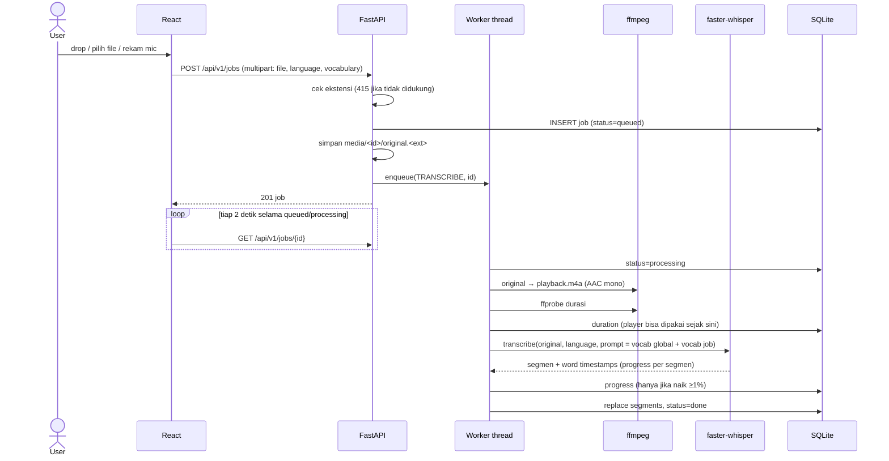
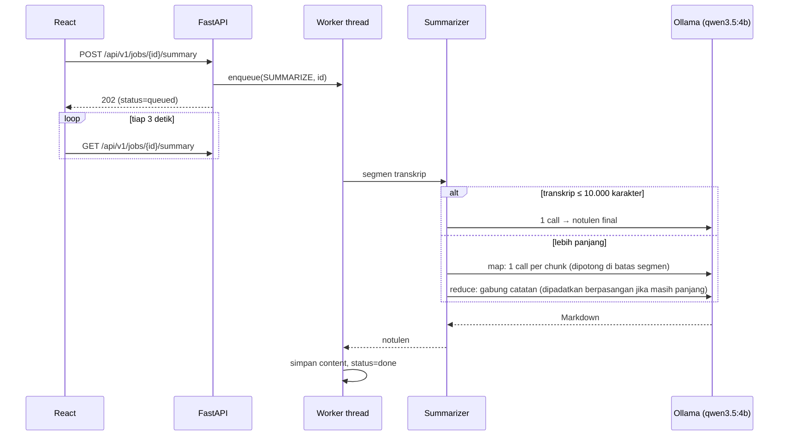

# Alur data

Sequence diagram alur utama: upload → transkrip, AI summary, playback/video, dan search.

## 1. Upload → transkrip

- Gagal di langkah mana pun → `status=failed` + pesan error; bisa *Re-transcribe*.
- Backend restart di tengah job → job `processing` di-requeue otomatis saat start.
- *Vocabulary* masuk sebagai `initial_prompt` Whisper (maks ~800 karakter; bagian akhir/vocab job diprioritaskan).

## 2. AI Summary

- `num_ctx=8192`, `think=false` (thinking menggandakan waktu tanpa gain), `keep_alive=2m` → model dilepas dari RAM supaya Whisper kebagian.
- Hasil bisa diedit (`PUT .../summary`, ditandai `edited`); *Regenerate* minta konfirmasi kalau sudah diedit.

## 3. Playback & video preview

- Audio: `GET /jobs/{id}/media` → `playback.m4a` (format yang bisa diputar semua browser), mendukung HTTP Range untuk seek.
- Video: `GET /jobs/{id}` mengembalikan `has_video` (ffprobe: ada stream video **bukan** `attached_pic`; hasil di-cache per file). Jika `true`, frontend memutar `GET /jobs/{id}/video` = file asli tanpa re-encode.
- Browser tidak bisa decode (event `error`, atau `videoWidth = 0`) → frontend otomatis pindah ke `<audio>`.
- Klik segmen → `seek(start)`; segmen aktif di-highlight dari `currentTime` media.

## 4. Search

`GET /jobs?q=` → `LIKE` case-insensitive di judul **dan** teks segmen (karakter `%`, `_`, `\` di-escape). Respons berisi cuplikan + timestamp (maks 3 per job); klik cuplikan membuka `/jobs/{id}?t=<detik>`.

---

[← Indeks dokumentasi](../README.md)
