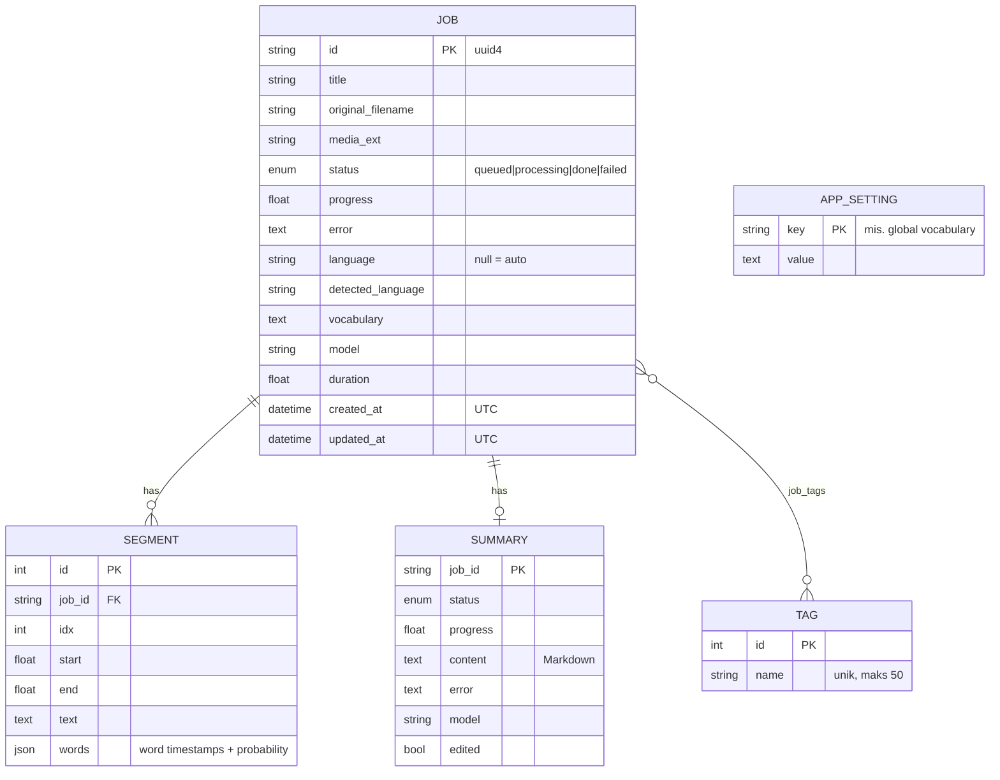

# Model data

Skema SQLite dan layout penyimpanan media per job.

SQLite `backend/data/audify.db`, dibuat dengan `create_all` (belum ada migrasi).

Media per job: `backend/data/media/<job_id>/original.<ext>` (upload asli) + `playback.m4a`. Hapus job = hapus folder ini.

---

[← Indeks dokumentasi](../README.md)
